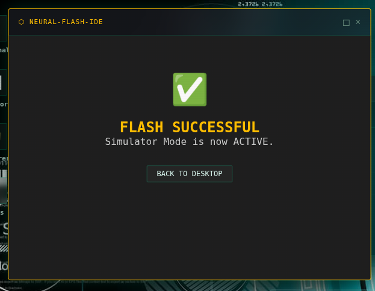

# NerveOS v0.7.1

NerveOS is a web-based workstation for embedded developers. It acts as a "Digital Twin" and mission control for physical devices, specifically built to handle real-time serial data and hardware automation.

## The Motivation

I've always been fascinated by the process of "connecting things"—the bridge between raw code and physical hardware. This project was born while developing [The Nerve](https://github.com/EngThi/The-Nerve), my physical ESP32-S3 cyberdeck. I wanted a professional dashboard to monitor telemetry and send commands without relying on generic serial monitors.

NerveOS is the software side of that passion, providing actual utility for field operations.

---

## Core Features

### 1. Real Bidirectional Serial Console
NerveOS uses the **Web Serial API** for real communication with hardware.
* **Green lines (←):** Data from the ESP32.
* **Yellow lines (→):** Commands from the browser.
* Supports 9600, 115200, and 230400 Baud Rates.

### 2. Hardware Monitor & Telemetry
Real-time tracking of device health.
* **CPU Load:** Visualized via a real-time graph.
* **Live Stats:** Temperature, encoder RPM, and system uptime.
* **Bridge Status:** LINKED or DISCONNECTED indicators.

### 3. Neural Flash IDE (Simulator)
For testing without physical microcontrollers.
* **Verification:** Requires a USB device connection to initiate the sequence.
* **Mock Telemetry:** Injects high-fidelity CPU and temperature data.

### 4. Dynamic Macro Builder
Library for hardware automation.
* Create and delete custom serial commands.
* Persistent storage via localStorage.

### 5. Notes Pro & Persistence
Built-in Markdown editor for documentation.
* **Auto-Sync:** Real-time saving to the virtual file system.
* **Export:** Download logs as .md files.

---

## Technical Visuals

Industrial-style theme:
* **Sharp Borders:** 4px window borders.
* **Deep Glassmorphism:** 20px blur with high-saturation.
* **CRT Simulation:** Integrated scanlines and flicker effects.
* **Mobile Ready:** Dedicated layout for smartphones.

## Hardware Setup

1. **Firmware:** Flash `firmware/firmware.ino` to your ESP32.
2. **Connection:** Click **LINK DEVICE** in HW Monitor.
3. **Simulation:** Use the **SIMULATOR** button if you have no physical hardware.

---

## Credits
Built by **ChefThi** (The Director).  
Inspired by the hardware hacking community and the need for better development tools. In addition to something else to connect to my cyberdeck. 😁😎
