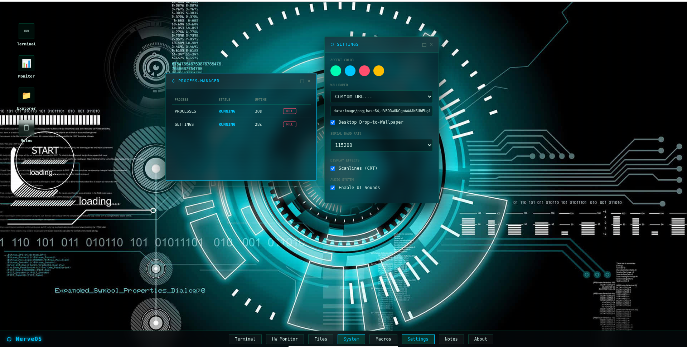
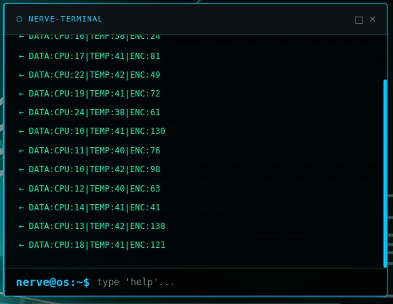
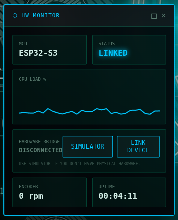
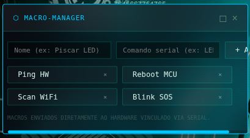

# NerveOS v0.7.1

NerveOS is a web-based workstation I built to talk to my microcontrollers. It’s basically a "Digital Twin" and mission control for my hardware projects, made to handle real-time serial data and automation without the clutter of the standard Arduino monitor.

## Why I built this

I’m a Computer Engineering student and I spend a lot of time on the bus. I needed a way to monitor my ESP32-S3 cyberdeck ([The Nerve](https://github.com/EngThi/The-Nerve)) without having to carry a laptop everywhere. I wanted a professional-looking dashboard that actually works on a mobile browser and lets me send commands on the fly.

---

## What it does

### Serial Console
The real deal. It uses the **Web Serial API** to talk to the ESP32.
* **Green (←):** Data coming from the hardware.
* **Yellow (→):** Commands I’m sending.
* Supports 9600, 115200, and 230400 Baud Rates.

### Hardware Monitor
Real-time tracking so I know if the ESP32 is alive.
* **CPU & Stats:** Visual graphs for load and temperature.
* **Status:** Quick indicators to see if the link is active.

### Dynamic Macro Builder
I got tired of typing the same commands over and over.
* I can create and save custom serial commands.
* Everything is saved in `localStorage` so it doesn't vanish when I refresh.

### Notes Pro
A simple Markdown editor inside the OS.
* I use this to write my devlogs or technical notes.
* I can export everything as `.md` files when I'm done.

---

### Power-User Customization

I wanted this to feel like *my* workstation, so I added some slick UX features:
*   **Instant Skinning:** Don't waste time with file pickers. You can **Drag & Drop** any image from your computer directly onto the desktop to change the wallpaper.
*   **Clipboard Sync:** Found a cool wallpaper online? Just copy the image and **Paste (Ctrl+V)** it into the URL field in Settings. It just works.
*   **CRT Emulation:** Toggle the `Scanline` filter to get that authentic 80s industrial terminal aesthetic.
*   **Persistent Themes:** All your accent colors, wallpapers, and baud rates are saved to `localStorage`, so it's ready the moment you boot up.

### Security & Access

The OS includes a "Field Access" lock screen to prevent unauthorized terminal input.
*   **Dynamic Password:** The system uses a rotating daily key based on the hardware's internal clock. 
*   **Format:** `MMDDYYYY` (Example: April 23, 2026 = `04232026`).
*   **Login Lore:** Your user ID changes based on the day of the week (e.g., `MONDAY_DIRECTOR`).

### Data Protocol

If you want to build your own firmware to talk to NerveOS, just send strings over serial in this format:
`DATA:CPU:load|TEMP:celsius|ENC:rpm`
*The OS will automatically parse these values and update the graphs in real-time.*

---

I wanted an industrial look that’s actually usable on a phone:
* **Sharp Borders:** No rounded corners, just 4px solid borders.
* **Glassmorphism:** Heavy blur so the text stays readable over the wallpaper.
* **Mobile Ready:** I spent a lot of time making sure the buttons and windows work on a small touch screen.

## How to use it

1. **Firmware:** Flash `firmware/firmware.ino` to your ESP32.
2. **Link:** Hit **LINK DEVICE** in the HW Monitor.
3. **No Hardware?** Use the **SIMULATOR** button to see how the telemetry looks.

---

> Built by **ChefThi**. This is the software half of my cyberdeck project. I just wanted a tool that didn't look like a 90s spreadsheet. 😎
